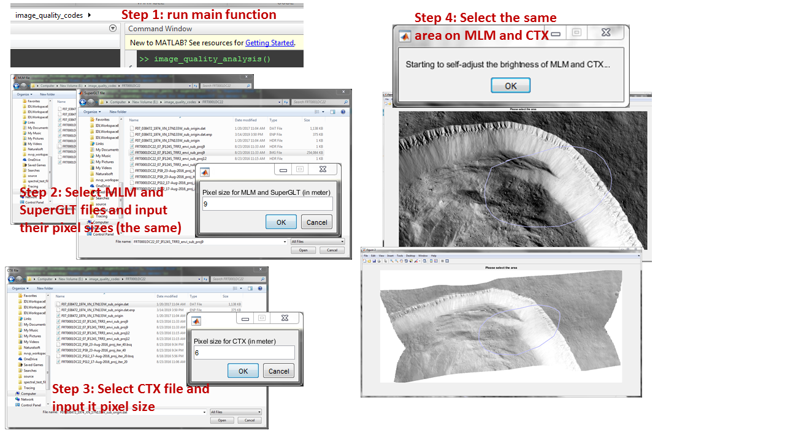
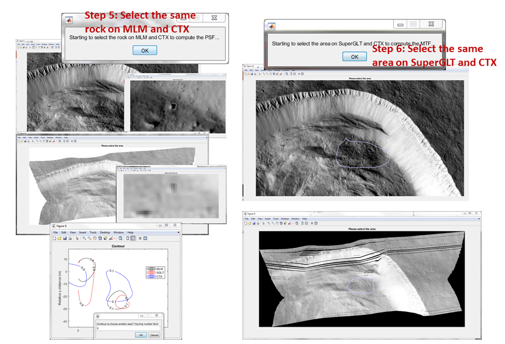

This is the MATLAB version by 03/14/2019.
# Image Quality Analysis
Including Rock Spreed Function (RSF) and Module Transfer Function (MTF).
For CRISM L-data and Context camera data.

CTX: Context camera data at 0.6 micrometer.

MLM: HyBER results for CRISM L data and display is defaulted as 0.592 micrometer.

SuperGLT: [SuperGLT projection](https://www.harrisgeospatial.com/Support/Self-Help-Tools/Help-Articles/Help-Articles-Detail/ArtMID/10220/ArticleID/19052/3816) results for CRISM L data and display is defaulted as 0.592 micrometer.

Instructions:

